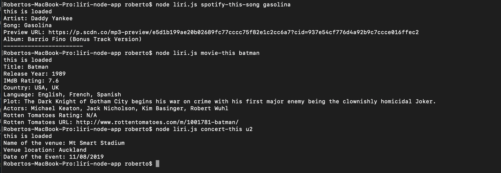
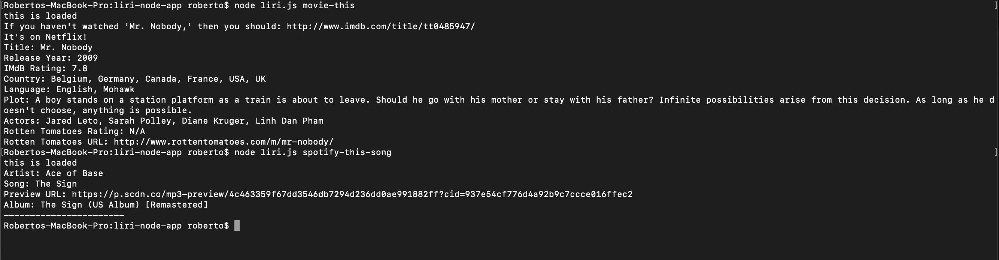

# liri-node-app

This app helps users by fulfilling their immediate entertainment needs. 
By using spotify, omdb, and bandsintown API's, users now have access to information about their favorite movies, music, and artists. 
Gone are the days of having to switch between various different applications and scrolling through different links and pages in order to gain access to the information you want. 

By inputting one of three different commands: spotify-this-song, movie-this, and concert-this - users can then input the name of a song, movie, or artist/band and receive information about that given input. Whether it be information about where and when your favorite artist/band might be playing next, information and ratings for your favorite movies, and or a quick preview link to your new favorite song, Liri can do it all. 

This app works through the use of the aforementioned API's as well as the use of axios and moment. By integrating these different technologies through javascript, the Liri app is capable of getting information and displaying it to the user in a simple and easy to read way. 

To run the app, you must open terminal, make sure that you are in the right directory, type in node followed by the name of the respective javascript file - in this case it is liri.js - and then any one of the previously listed commands and a relevant input. 

Here below are some examples of how the app functions within terminal:

The app also has default responses for the 'spotify-this-song' and 'movie-this' commands that will show up when the user doesn't input anything after those given commands:

